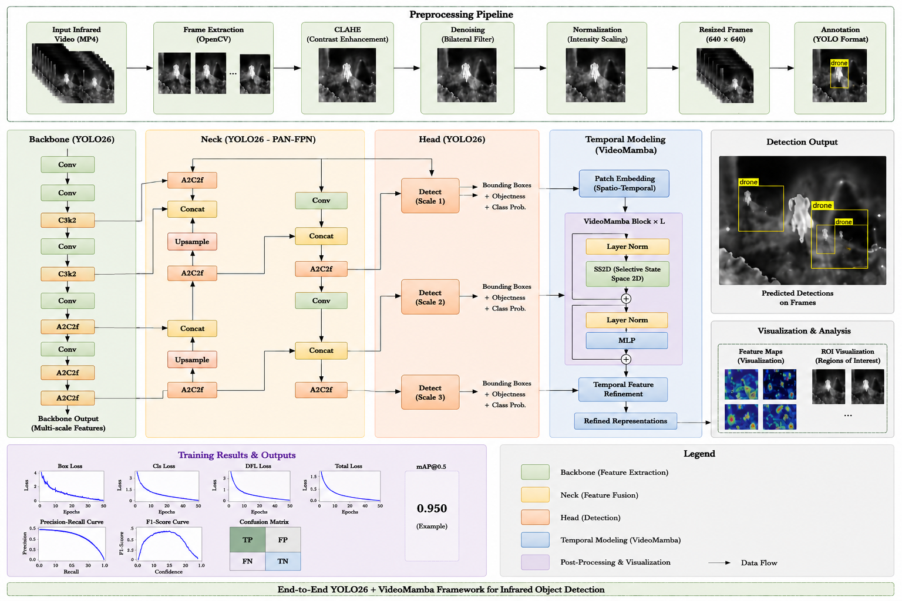

# Temporal Aware Small Object Detection in Infrared Videos Using YOLO26 and VideoMamba

Final internship submission for infrared video object detection, tracking, and temporal refinement.

The pipeline combines:

- Frame extraction from infrared videos
- Preprocessing with CLAHE and denoising
- Feature extraction using a YOLO detector
- ROI-aware temporal refinement with VideoMamba
- Final detection and visualization for infrared surveillance-style footage



## Project Highlights

- Built for infrared targets with low contrast and noisy backgrounds
- Uses a custom-trained YOLO checkpoint (`best.pt`)
- Produces YOLO-format labels from infrared annotations
- Supports dataset sampling, preprocessing, and training in one workflow
- Designed to be easy to extend for future experiments with tracking and temporal modeling
- Includes the final submitted research report in `docs/final_report.pdf`

## Repository Structure

```text
infrared_yolovideomamba_repo/
├── assets/
│   └── workflow1.png
├── docs/
│   └── final_report.pdf
├── src/
│   ├── pipeline.py
│   └── videomamba_integration.py
├── requirements.txt
└── README.md
```

## Pipeline

```text
Infrared Video
    ↓
Frame Extraction
    ↓
YOLO26
    ↓
Feature Maps
    ↓
VideoMamba
    ↓
Temporal Features
    ↓
Final Detection
```

## What the pipeline does

1. Extracts frames from infrared videos
2. Applies infrared-friendly preprocessing:
   - CLAHE
   - Denoising
   - Normalization / resizing
3. Converts annotations into YOLO label format
4. Builds a YOLO-ready dataset structure
5. Trains or fine-tunes a YOLO detector
6. Provides a clean integration hook for VideoMamba

## Setup

```powershell
git clone https://github.com/myself-archita/infrared-yolovideomamba.git
cd infrared-yolovideomamba
python -m venv .venv
.venv\Scripts\activate
pip install -r requirements.txt
```

## Usage

### 1) Preprocess the dataset

```powershell
python src/pipeline.py --archive "C:\path\to\archive (1).zip" --skip-train
```

### 2) Train YOLO

```powershell
python src/pipeline.py --archive "C:\path\to\archive (1).zip" --model "C:\path\to\best.pt" --epochs 50 --imgsz 640
```

### 3) Run only frame extraction

```powershell
python src/pipeline.py --source-root "C:\path\to\extracted_dataset" --frames-only
```

### 4) Connect VideoMamba

```powershell
python src/pipeline.py --source-root "C:\path\to\extracted_dataset" --skip-train --videomamba-script C:\path\to\train_videomamba.py --videomamba-args --data .\infrared_work\yolo_dataset --epochs 50
```

## Model and Results

- Custom YOLO checkpoint: `best.pt`
- Research report: [`docs/final_report.pdf`](docs/final_report.pdf)
- Pipeline figure: `assets/workflow1.png`

For GitHub hygiene, the large dataset and trained weights are intentionally ignored by default. If you want, you can upload:

- a small sample clip
- a tiny demonstration subset
- or an inference-only demo notebook

## Why this looks strong for recruitment

- Clear problem statement
- Real-world infrared use case
- Strong hybrid approach: detection + temporal modeling
- Reusable preprocessing and training code
- Clean documentation and reproducible setup

## Acknowledgment

This repository reflects the final internship submission by Archita Guha Roy on temporal-aware infrared object detection using YOLO26 and VideoMamba.

